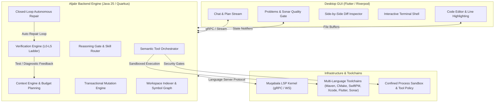
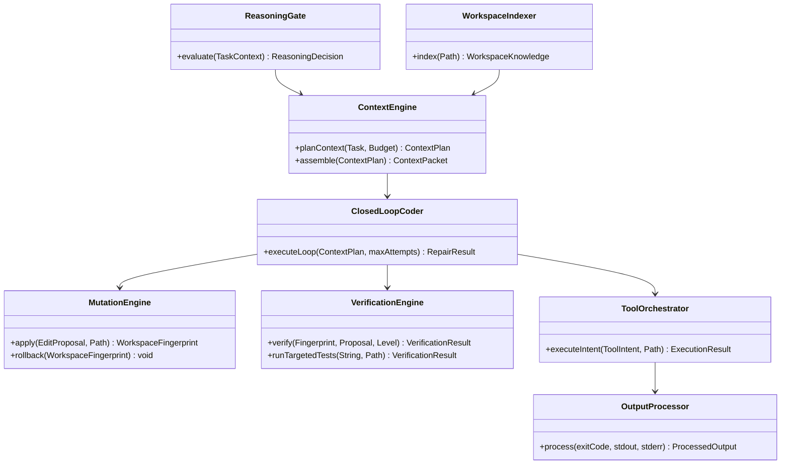
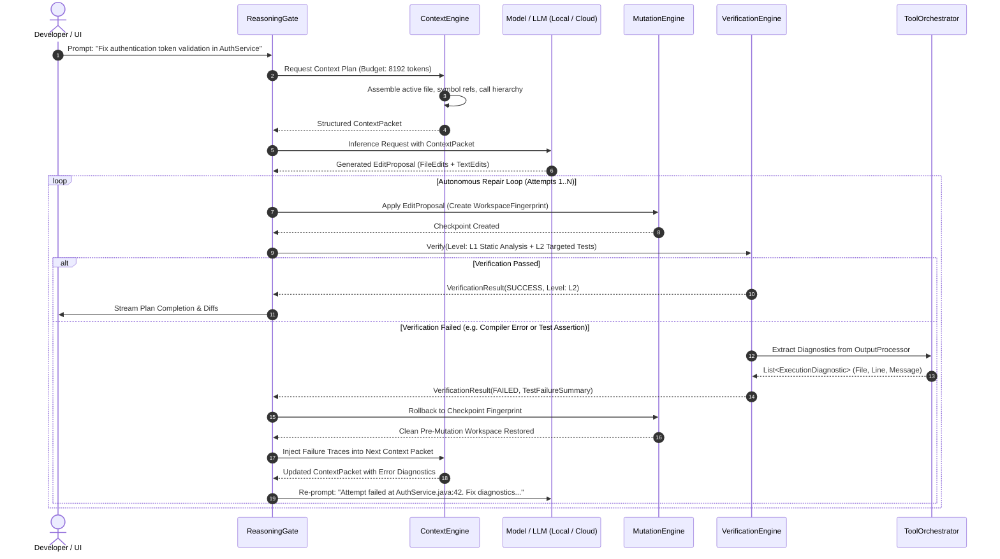
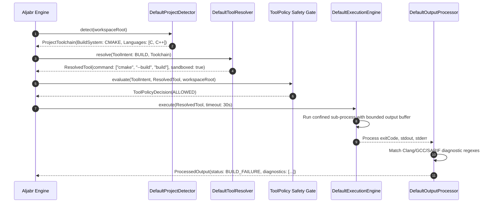
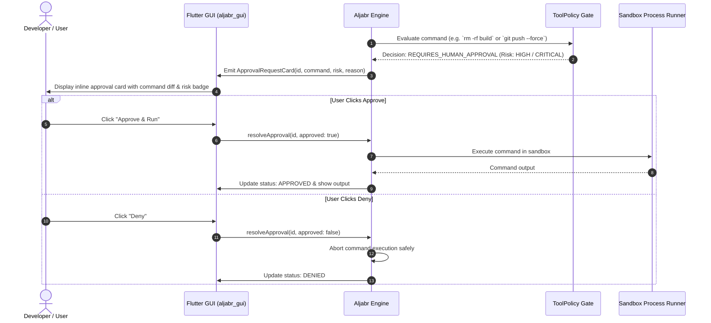

# Aljabr (الجبر) — Autonomous AI Coding & Engineering Substrate

> **Aljabr (Algebra / Restoration)** is a local-first, autonomous software engineering platform built on the Wayang Platform framework. It synthesizes the interactive ergonomics of **Codex / Cursor**, the autonomous planning and verification rigor of **Google Antigravity**, and the deterministic tool orchestration and execution safety of **Claude Code**.

---

## 🌟 Executive Synthesis: Codex + Antigravity + Claude Code

Aljabr bridges the gap between interactive IDE assistants and fully autonomous agent loops:

```
┌────────────────────────────────────────────────────────────────────────────────────────┐
│                                ALJABR UNIFIED SUBSTRATE                                │
├─────────────────────────┬─────────────────────────────┬────────────────────────────────┤
│   CODEX / CURSOR UX     │     ANTIGRAVITY RIGOR       │        CLAUDE CODE SAFETY      │
├─────────────────────────┼─────────────────────────────┼────────────────────────────────┤
│ • Side-by-side Diff     │ • Adaptive Reasoning Gate   │ • Semantic Tool Orchestrator   │
│ • Context Chips (@file) │ • Graduated Verify Ladder   │ • Confined Process Sandbox     │
│ • Real-time Streaming   │ • Closed-Loop Self-Repair   │ • Human-in-the-Loop Gateways   │
│ • Line-level Jump-links │ • Structured Step Checklist │ • Deterministic Diagnostics    │
│ • Problems / Sonar Tab  │ • Transactional Rollbacks   │ • Multi-Language Auto-Detect   │
└─────────────────────────┴─────────────────────────────┴────────────────────────────────┘
```

---

## 🏛 Architecture & Building Blocks

Aljabr operates across three coordinated tiers:
1. **Frontend Tier (`aljabr_gui`)**: A desktop IDE interface written in Flutter (Riverpod state management) providing side-by-side Code/Diff/Terminal/Problems views, context pinning (`@` mentions), live plan tracking, and verification status badges.
2. **Backend Engine Tier (`aljabr-engine` & `aljabr-api`)**: A reactive Quarkus service (Java 25) implementing the cognitive lifecycle: Reasoning Gate $\to$ Context Planning $\to$ Mutation Engine $\to$ Verification Ladder $\to$ Closed-Loop Autonomous Repair.
3. **LSP & Tool Substrate (`muqabala`)**: A headless LSP and Debug Adapter Protocol (DAP) kernel managing language servers, symbol tables, Open VSX extensions, and AST indexers.



---

## 🧩 Component Specifications



| Component | Responsibility | Key Classes / Interfaces |
| :--- | :--- | :--- |
| **Reasoning Gate** | Analyzes task complexity and dynamically selects whether to use direct reactive tools, single-step execution, or multi-step autonomous planning. | [`ReasoningGate`](file:///Users/bhangun/Workspace/workkayys/Products/Wayang/wayang-platform/Wayang-Projects/Wayang-Agents/Aljabr/Backend/aljabr-engine/src/main/java/tech/kayys/aljabr/engine/skill/routing/ReasoningGate.java), [`SkillSelector`](file:///Users/bhangun/Workspace/workkayys/Products/Wayang/wayang-platform/Wayang-Projects/Wayang-Agents/Aljabr/Backend/aljabr-engine/src/main/java/tech/kayys/aljabr/engine/skill/routing/SkillSelector.java) |
| **Workspace Indexer** | Parses ASTs, indexes symbol definitions, references, call graphs, and dependency relationships across workspace files. | [`WorkspaceIndexer`](file:///Users/bhangun/Workspace/workkayys/Products/Wayang/wayang-platform/Wayang-Projects/Wayang-Agents/Aljabr/Backend/aljabr-engine/src/main/java/tech/kayys/aljabr/engine/index/indexer/WorkspaceIndexer.java), [`RelationIndex`](file:///Users/bhangun/Workspace/workkayys/Products/Wayang/wayang-platform/Wayang-Projects/Wayang-Agents/Aljabr/Backend/aljabr-engine/src/main/java/tech/kayys/aljabr/engine/index/RelationIndex.java) |
| **Context Engine** | Constructs budget-constrained prompt context packets with deterministic prioritization (active file $\to$ symbols $\to$ dependencies $\to$ related files $\to$ recent failure traces). | [`ContextEngine`](file:///Users/bhangun/Workspace/workkayys/Products/Wayang/wayang-platform/Wayang-Projects/Wayang-Agents/Aljabr/Backend/aljabr-engine/src/main/java/tech/kayys/aljabr/engine/context/DefaultContextEngine.java), [`ContextBudgeter`](file:///Users/bhangun/Workspace/workkayys/Products/Wayang/wayang-platform/Wayang-Projects/Wayang-Agents/Aljabr/Backend/aljabr-engine/src/main/java/tech/kayys/aljabr/engine/context/ContextBudgeter.java) |
| **Mutation Engine** | Applies atomic file edits, unified diffs, and AST replacements with transactional rollback checkpoints (`WorkspaceFingerprint`). | [`MutationEngine`](file:///Users/bhangun/Workspace/workkayys/Products/Wayang/wayang-platform/Wayang-Projects/Wayang-Agents/Aljabr/Backend/aljabr-engine/src/main/java/tech/kayys/aljabr/engine/patch/mutation/MutationEngine.java) |
| **Verification Engine** | Executes a graduated 6-tier verification ladder (L0: Syntax $\to$ L1: Sonar Lint & Security $\to$ L2: Targeted Tests $\to$ L3: Affected Callers $\to$ L4: Module Tests $\to$ L5: Full Suite). | [`VerificationEngine`](file:///Users/bhangun/Workspace/workkayys/Products/Wayang/wayang-platform/Wayang-Projects/Wayang-Agents/Aljabr/Backend/aljabr-engine/src/main/java/tech/kayys/aljabr/engine/verification/VerificationEngine.java), [`DefaultVerificationEngine`](file:///Users/bhangun/Workspace/workkayys/Products/Wayang/wayang-platform/Wayang-Projects/Wayang-Agents/Aljabr/Backend/aljabr-engine/src/main/java/tech/kayys/aljabr/engine/verification/DefaultVerificationEngine.java) |
| **Closed-Loop Coder** | Coordinates the self-healing cycle: Generates patch $\to$ applies mutation $\to$ verifies $\to$ if failed, rolls back and re-prompts with extracted diagnostics until success. | [`ClosedLoopCoder`](file:///Users/bhangun/Workspace/workkayys/Products/Wayang/wayang-platform/Wayang-Projects/Wayang-Agents/Aljabr/Backend/aljabr-engine/src/main/java/tech/kayys/aljabr/engine/repair/DefaultClosedLoopCoder.java) |
| **Tool Orchestrator** | Discovers workspace toolchains and maps high-level intents (`BUILD`, `RUN_TEST`, `FORMAT`, `LINT`, `STATIC_ANALYSIS`) to sandboxed execution commands. | [`ToolOrchestrator`](file:///Users/bhangun/Workspace/workkayys/Products/Wayang/wayang-platform/Wayang-Projects/Wayang-Agents/Aljabr/Backend/aljabr-engine/src/main/java/tech/kayys/aljabr/engine/orchestrator/ToolOrchestrator.java), [`ToolPolicy`](file:///Users/bhangun/Workspace/workkayys/Products/Wayang/wayang-platform/Wayang-Projects/Wayang-Agents/Aljabr/Backend/aljabr-engine/src/main/java/tech/kayys/aljabr/engine/orchestrator/policy/ToolPolicy.java) |
| **Output Processor** | Ingests raw terminal output, compiler logs (`javac`, `clang`, `swiftc`), test assertions (`JUnit`, `ctest`, `XCTest`), and OASIS standard SARIF JSON reports into structured `ExecutionDiagnostic` records. | [`OutputProcessor`](file:///Users/bhangun/Workspace/workkayys/Products/Wayang/wayang-platform/Wayang-Projects/Wayang-Agents/Aljabr/Backend/aljabr-engine/src/main/java/tech/kayys/aljabr/engine/orchestrator/output/OutputProcessor.java), [`SarifReportParser`](file:///Users/bhangun/Workspace/workkayys/Products/Wayang/wayang-platform/Wayang-Projects/Wayang-Agents/Aljabr/Backend/aljabr-engine/src/main/java/tech/kayys/aljabr/engine/orchestrator/output/SarifReportParser.java) |

---

## 🔄 End-to-End Sequence Diagrams

### 1. Autonomous Coding & Closed-Loop Repair Loop



---

### 2. Multi-Language Toolchain Orchestration & Sandboxed Execution



---

### 3. Human-in-the-Loop Approval & Interactive Security Gate



---

## 🛠 Supported Build Systems & Multi-Language Toolchains

Aljabr automatically discovers project toolchains and executes builds, tests, formatting, linting, and static analysis without manual script configuration:

| Build System | Languages | Build Command | Test Command | Format / Lint Command | Static Analysis / SARIF |
| :--- | :--- | :--- | :--- | :--- | :--- |
| **Maven** | Java, Kotlin | `mvn compile -DskipTests` | `mvn test -Dtest=...` | `mvn spotless:apply` / `checkstyle` | `sonar-scanner` / `SpotBugs` |
| **Gradle** | Java, Kotlin, Groovy | `./gradlew assemble` | `./gradlew test --tests ...` | `./gradlew ktlintFormat` | `sonar-scanner` / Detekt |
| **CMake** | C, C++ | `cmake --build build` | `ctest --test-dir build -R ...` | `clang-format -i` / `clang-tidy` | `sonar-scanner` / `cppcheck` |
| **Make / Meson**| C, C++ | `make` / `meson compile` | `make test` / `meson test` | `clang-format -i` | `sonar-scanner` |
| **Swift PM** | Swift | `swift build` | `swift test --filter ...` | `swift-format -i` / `swiftlint` | `swiftlint --reporter sarif` |
| **Xcode** | Swift, Objective-C | `xcodebuild build` | `xcodebuild test -only-testing:...` | `clang-format -i` (ObjC) | `sonar-scanner` / `swiftlint` |
| **Flutter** | Dart | `flutter build` | `flutter test <path>` | `dart format` / `dart analyze` | `dart analyze` |
| **Cargo** | Rust | `cargo build` | `cargo test <name>` | `cargo fmt` / `cargo clippy` | `cargo clippy --message-format=json` |
| **Go** | Go | `go build ./...` | `go test -run ...` | `gofmt -w` / `golangci-lint` | `golangci-lint run --out-format sarif` |
| **Python** | Python | `python -m build` | `pytest -k ...` | `black` / `ruff` | `bandit -f json` / `ruff --output-format=sarif` |

---

## 🚀 Building & Running

### Prerequisites
- **JDK 25** (with Maven 3.9+)
- **Flutter SDK 3.x+**
- **Docker** (optional, for sandboxed container isolation)

### 1. Build Backend & LSP Kernel
```bash
# Build headless LSP Kernel (Muqabala)
cd Wayang-Projects/Utilities/muqabala
mvn clean package -DskipTests

# Build Aljabr Engine & API
cd ../../Wayang-Agents/Aljabr/Backend
mvn clean package -DskipTests
```

### 2. Run Automated Verification Tests
```bash
# Run all Aljabr backend unit & integration tests (40/40 tests)
cd Wayang-Projects/Wayang-Agents/Aljabr/Backend/aljabr-engine
mvn test

# Run Flutter GUI unit & widget tests (10/10 tests)
cd ../../aljabr_gui
flutter test
```

### 3. Launch Desktop Application
```bash
# Start Backend Service (Quarkus Dev Mode with Live Reload)
cd Wayang-Projects/Wayang-Agents/Aljabr/Backend/aljabr-api
mvn quarkus:dev

# Start Flutter Desktop GUI
cd ../aljabr_gui
flutter run -d macos # or -d linux, -d windows
```

---


## FAQ

### Why used gollek run instead of grpc?
Ran command: `grep -rnwi "grpc" .`
Ran command: `find . -name "*.java"`
Viewed GollekProvider.java:1-44
Ran command: `cat ./src/main/java/tech/kayys/wayang/provider/gollek/GollekInferenceProvider.java | grep -n "implements InferenceProvider"`
Ran command: `grep -rnwi "GollekInferenceProvider" ../../../../`
Ran command: `cat /Users/bhangun/.gemini/antigravity/brain/c611579a-d164-4fdc-a460-b023fba73c33/.system_generated/tasks/task-2066.log`
Used tool: manage_task
Used tool: manage_task
Ran command: `grep -rnwi "GollekInferenceProvider" .`
Ran command: `cat /Users/bhangun/.gemini/antigravity/brain/c611579a-d164-4fdc-a460-b023fba73c33/.system_generated/tasks/task-2074.log`
Ran command: `cat src/main/resources/META-INF/services/tech.kayys.wayang.inference.InferenceProvider`
Viewed GrpcGollekStrategy.java:1-50
Viewed GollekInferenceProvider.java:50-100
Ran command: `git log -p -1 src/main/java/tech/kayys/wayang/provider/gollek/GollekInferenceProvider.java`

That is an excellent architectural question! 

You noticed that `GollekInferenceProvider` hardcodes delegating to the `gollek run` CLI subprocess instead of utilizing the `GrpcGollekStrategy` that exists elsewhere in the codebase. 

There are a few key reasons why `AljabrEngine` currently defaults to the `gollek run` CLI approach instead of the gRPC API:

### 1. Zero-Configuration Local Setup
The primary reason is that calling the `gollek run` CLI is entirely stateless. If `AljabrEngine` uses gRPC, it requires a separate `gollek server` daemon to be continually running in the background on a specific port (like `localhost:9000`). 
By using `gollek run`, the Java backend can completely manage the lifecycle of the LLM. It guarantees that if the backend is running and the `gollek` binary is in the `PATH`, inference will work out-of-the-box without requiring the user to manually launch and manage a separate background server process.

### 2. Differing SPI Abstraction Layers
If you look at the Java code, you'll see two different provider interfaces:
- `tech.kayys.wayang.provider.Provider` (which `GollekProvider` and `GrpcGollekStrategy` implement)
- `tech.kayys.wayang.inference.InferenceProvider` (which `GollekInferenceProvider` implements)

`AljabrEngine` (specifically `AbstractAgentExecutionStrategy`) relies exclusively on the `InferenceProvider` SPI. Currently, `GollekInferenceProvider` is the only registered SPI implementation for this, and it was written specifically as a direct CLI wrapper to ensure maximum portability on macOS (e.g., executing GGUF/Metal directly). The `GrpcGollekStrategy` belongs to the other abstraction layer and isn't currently wired into the `AljabrEngine` loop.

### 3. The Trade-off (The Memory Issue)
As you correctly experienced, the massive downside to the CLI `gollek run` approach is **memory thrashing and latency**. 
Because it's a CLI tool, the 8GB+ model must be loaded into macOS Unified Memory every single time the agent needs to think, and unloaded immediately after. In a multi-step ReAct loop (where the agent executes 5 tools in a row), this causes extreme memory pressure. 

A gRPC server approach would solve this entirely, as the model would stay persistently loaded in VRAM, making tool loops lightning fast and eliminating memory spikes. If `gollek` supports a stable gRPC server mode, wiring `GrpcGollekStrategy` into `AljabrEngine` would be the best permanent upgrade for the architecture!


## 📜 License
Part of the **Wayang Platform** repository. Licensed under the Apache License 2.0.
